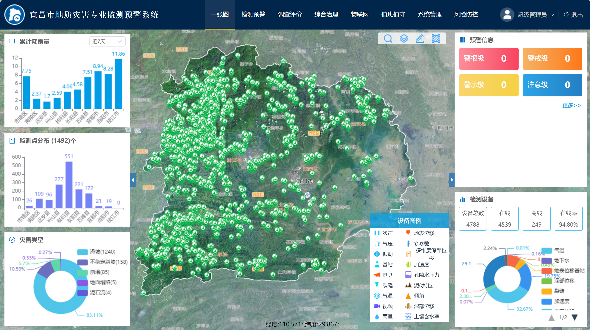

<!--
 * @Author: 陈巧龙
 * @Date: 2023-11-22 14:13:59
 * @LastEditors: Please set LastEditors
 * @LastEditTime: 2024-02-21 15:08:20
 * @FilePath: \DW-Systems\README.md
 * @Description: 
-->

# D-W-System

## 项目简介

1、本项目采用Vue3 + Vite + Element Plus + pinia + Echarts进行编写，地图展示方面采用的是OpenLayers 6，主要目的是熟悉对Vue3框架以及OpenLayers的使用。

2、部分代码未进行展示，目前项目正在优化中，后续再进行更新。

3、欢迎大家一起沟通交流。

## 项目启动

### 依赖安装

> npm install

### 启动项目

> npm run dev

## 参考资料

##### 1、[Vue3](https://cn.vuejs.org/)

##### 2、[Element Plus](https://element-plus.org/zh-CN/)

##### 3、[OpenLayer6 API](https://openlayers.org/en/v6.15.1/apidoc/)

##### 4、[JavaScript](https://developer.mozilla.org/zh-CN/docs/Web/JavaScript/Reference/Global_Objects)

##### 5、[ECharts](https://echarts.apache.org/zh/index.html)

## 界面展示
